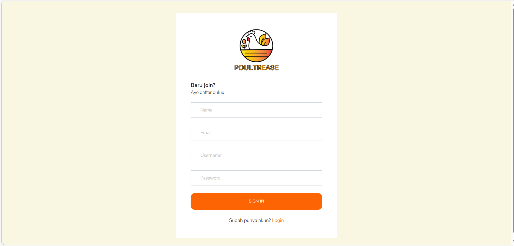
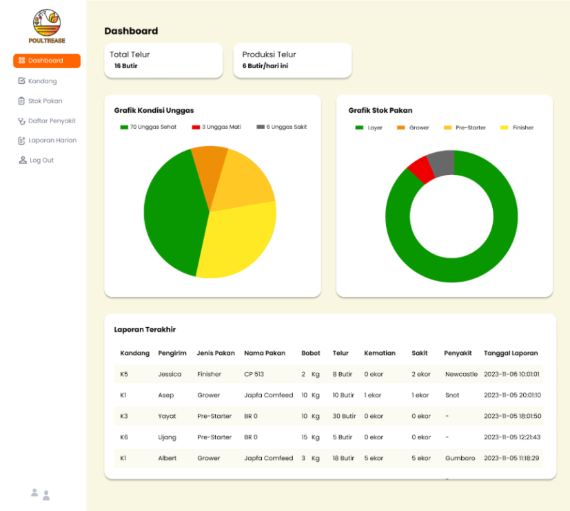
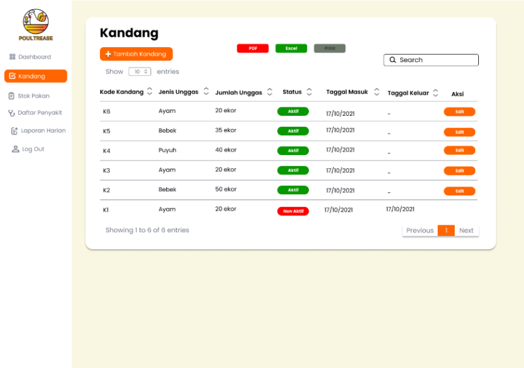
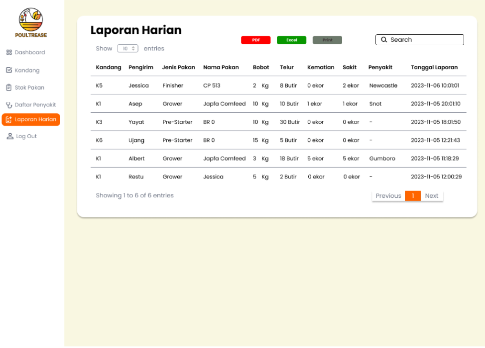

# Poultry Farm Management System

Poultry Farm Management System is a web and mobile application designed to optimize poultry farm management operations. The system helps farm owners record and monitor daily farm activities such as poultry population, feed usage, egg production, and poultry health conditions.

This project was developed as part of coursework for Web Programming, Mobile Programming, and Cloud Computing. The system is designed to improve efficiency in poultry farm management by utilizing a REST API architecture that enables seamless integration between web and mobile applications.

---

## 👩‍💻 My Role
Full Stack Developer (REST API & Front-End)

My contributions in this project include:

- Designing and developing RESTful APIs for the poultry management system
- Developing the web dashboard user interface
- Integrating frontend components with REST API
- Implementing poultry cage management features
- Developing daily farm reporting features
- Implementing responsive UI using Bootstrap

---

## 🚀 Features

- User authentication system
- Farm monitoring dashboard
- Poultry cage management
- Feed management
- Daily farm activity reporting
- Egg production monitoring
- Poultry disease and mortality monitoring
- REST API integration for web and mobile applications

---

## 🛠 Tech Stack

- Laravel
- REST API
- PHP
- MySQL
- Bootstrap
- HTML
- CSS
- JavaScript

---

## 📸 Application Interface

### Sign in Page

### Dashboard

### Poultry Cage Management

### Daily Farm Report

---
## 📚 Project Type
Team Project - Web Programming, Mobile Programming, and Cloud Computing